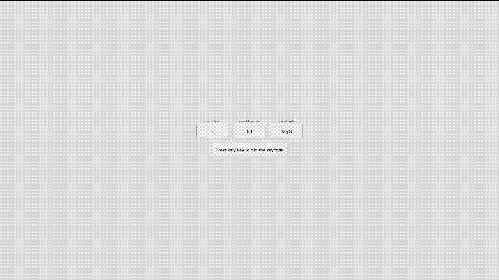

# Keycode Info

This project displays the key, keycode and event code whenever a key is pressed on the keyboard

## How It's Made:

Uses a keydown listener on the window to display info dynamically
**Tech used:**
HTML, CSS, JavaScript
**Preview:**

    

## Optimizations:

It would be fun to come back and hardcode a keyboard into the html that highlights the key pressed as well as provides the keycode at the top

## Lessons Learned:

More work on event listeners and working with the window
