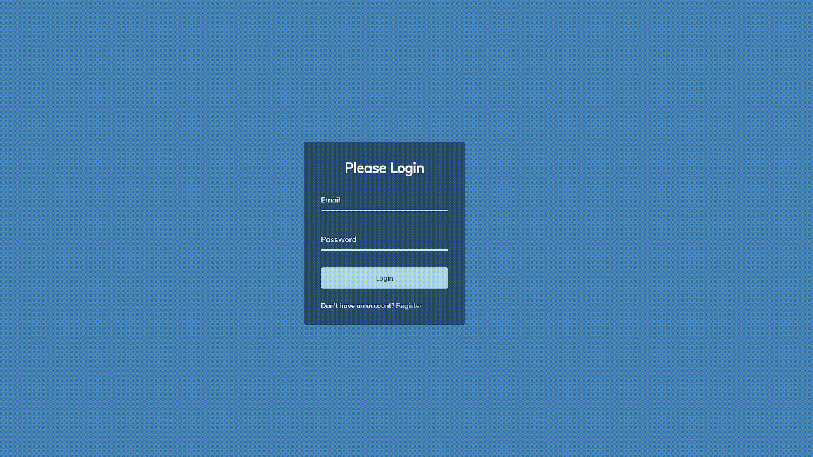

# Form Wave

This is a standard login form with a wave animation on the placeholder text for the login fields.

## How It's Made:

Dynamically splits each letter into an array and adds a transition effect for an animated wave.

**Tech used:**
HTML, CSS, JavaScript
**Preview:**

    

## Optimizations:

I would come back and fix the wave to work in firefox. Currently only functions in Chrome.

## Lessons Learned:

Learned a bit about the cubic bezier transform property as well as how to use scale() to mimic a button being pressed.
