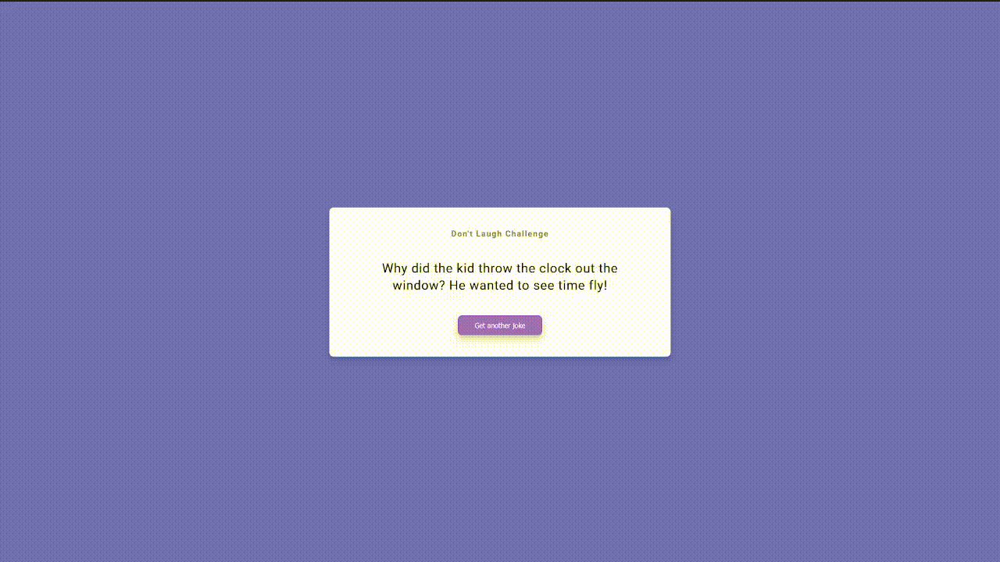

# Joke Generator

This is a small application that utilizes a third party API, icanhazdadjokes, to fetch a new joke on each button click

## How It's Made:

**Tech used:**
HTML, CSS, JavaScript, Third Party API
**Preview:**

    

## Optimizations:

Started with fetch & .then but refactored to use async await

## Lessons Learned:

Refreshed learning on working with third party APIs
