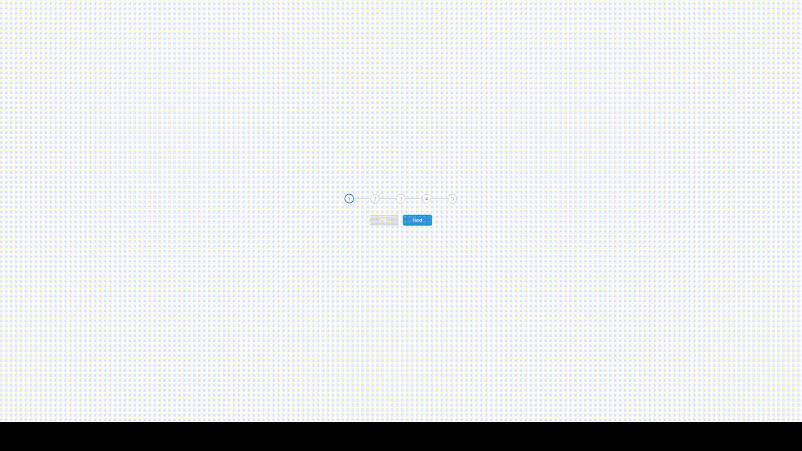

# progressionTracker
Simple tracker that can be used for sites that have multi-step forms or for shopping cart progress.

## How It's Made:

**Tech used:** 
HTML, CSS, JavaScript

**Preview:**

    

## Optimizations:
Would come back to display text with information on progress steps.

## Lessons Learned:
I learned how to create custom css properties. These come in handy when a single property is reused across multiple selectors since they can be changed once and the changes will apply across the entire stylesheet.