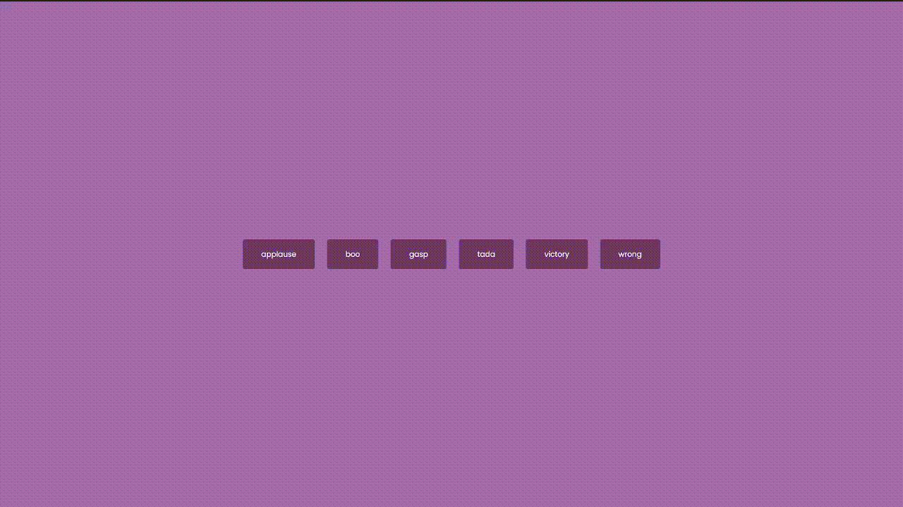

# Sound Board

This is a simple sound board that utilizes the HTML audio tag to play sample audio sounds on click

## How It's Made:

JS creates an array out of the element id's then dynamically adds event listeners to each element to play/pause music on click
**Tech used:**
HTML, CSS, JavaScript
**Preview:**

    

## Optimizations:

Would like to come back and add more styling and play/pause buttons

## Lessons Learned:

Learned a bit about the audio tag and the built in functions that accompany it
